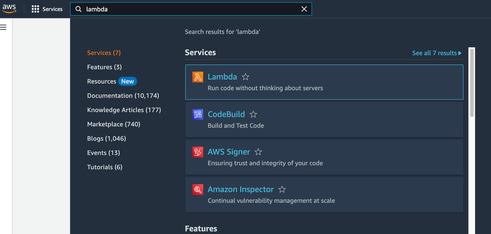
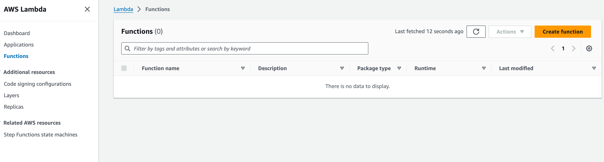
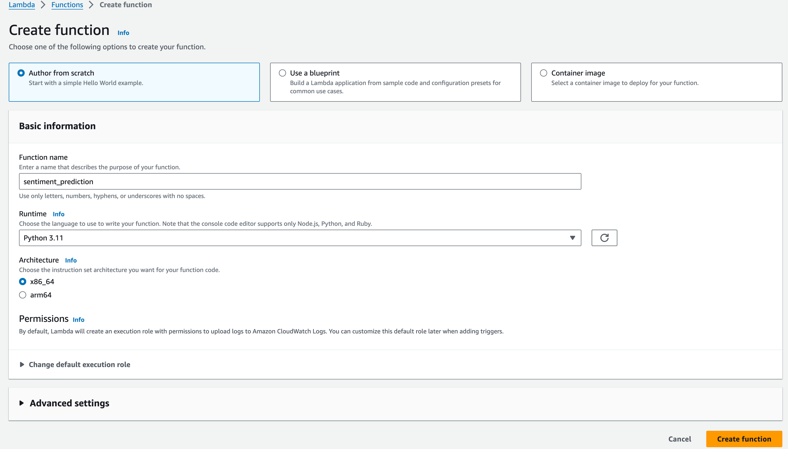
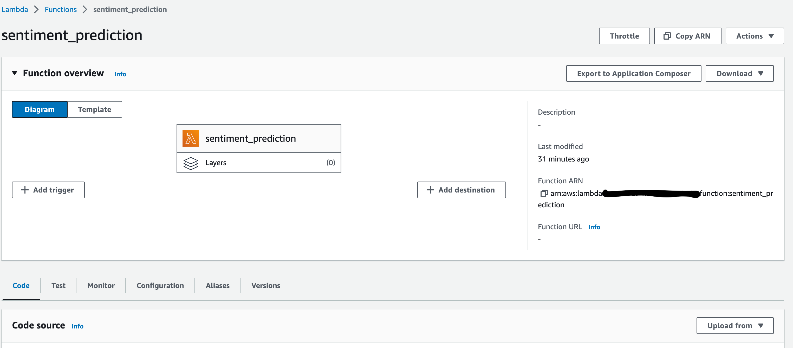
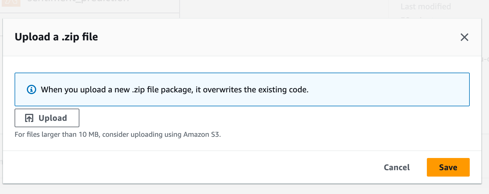

# Sentiment Classification

Automatization of classifying customer reviews as positive or negative is crucial for e-commerce. This project offers a solution to this problem by providing an endpoint. Users submit a review and in response, the system provide a positive or negative outcome, indicating the polarity of the review.

# Getting Started

You will find following operations to build, deploy and test a serverless application in this document.

1. Run and test a lambda function locally using AWS SAM CLI
2. Deploy the lambda function on AWS Lambda

## Prerequisites

- Python 3.11
- NLTK (python library)
- Docker

## Dataset

This project uses movie reviews dataset in the NLTK library to train the sentiment classification model.

## Model Training

The jupyter notebook file `train_sentiment_analysis.ipynb` contains text processing and training sentiment classification model. The model is saved as *sa_classifier.pickle* file which will be used for prediction later. Place the pickle file in the same directory as the lambda handler. In this project, it should be under the hello_world directory.

## The *lambda_handler* function
 The *lambda_handler* function is located in hello_world/app.py that takes the parameters *event* and *context*. *“event”* contains the entire payload of the API call. We look in the "body" value of the event. The function sends the review data in the "body" into get_sentiment and then returns the sentiment value to the caller.

## Build, test and deploy serverless application

### 1. Using AWS SAM CLI Local for testing a serverless application locally
 
I explained step-bys-step how to use SAM CLI for running a lambda function locally [here](commands.md).

### 2. Creating AWS Lambda Function
 

The zip package should include the python script containing your *lambda_handler* function, your dependencies and your model. [Here](https://docs.aws.amazon.com/lambda/latest/dg/python-package.html#python-package-create-dependencies) is a tutoral on preparing the .zip archive for python lambda function.  

Lambda functions have a size limitation of 250MB. If your model is larger, you can upload the model to S3 as a separate file, which later you will load from our code. [Here](https://docs.aws.amazon.com/AmazonS3/latest/userguide/upload-objects.html) is a tutorial on uploading files to S3. 

#### Important Note: 

If you are using MacOS while you are preparing the dependencies for .zip archive, 
you can get problem while testing on AWS Lambda. Such as:

`Unable to import module 'lambda_function': No module named 'regex._regex'`

This problem is most probably related to package discrapencies between your local and lambda function uses. If you encounter an error like below, there are many ways to fix it but, using docker containers to install your packages is the easiest way.

Steps to install dependencies:

- Pull `python:3.11.7-slim` image or the version that you need. (You can skip this item as below one is going to download it anyways)

- Run your container while mounting your local folder which contains your code:

`docker run -v <path-to-your-workspace>/<project-name> -it python:3.11.7-slim bash`

`docker run -v $(pwd):/deployment-test -it python:3.11.7-slim bash`

- Now, you are in the home directory of the docker container, and you have to navigate your mounted folder.

`cd <project-name>`

- Install your required packages using `pip` into a separate directory. Let's create a directory for that purpose which name `aws-lib`

`mkdir aws-lib`

`pip install -r requirements.txt -t /aws-lib`

- After installing all the required dependencies into `aws-lib` directory, verify that all the required ones are already located in it.

- Now we can detach from the container and can use those installed packages to build our bundle and can deploy it on AWS Lambda.

- We have to go to our project folder:

`cd <path-to-your-workspace>/<project-name>`

- There has to be a folder called `aws-lib` along with your `lambda_function.py` which was generated from our container in previous steps.

- Go into that folder and run below command to zip every dependencies:

`zip -r ../<package-name>.zip .`

- Now, you need to get back to the project folder and include your python script into the generated package in previous step:

`zip <package-name>.zip lambda_function.py`

At this point, your package is ready to be deployed to AWS Lambda.

# Contact

If you have any question or comment please create an issue.
